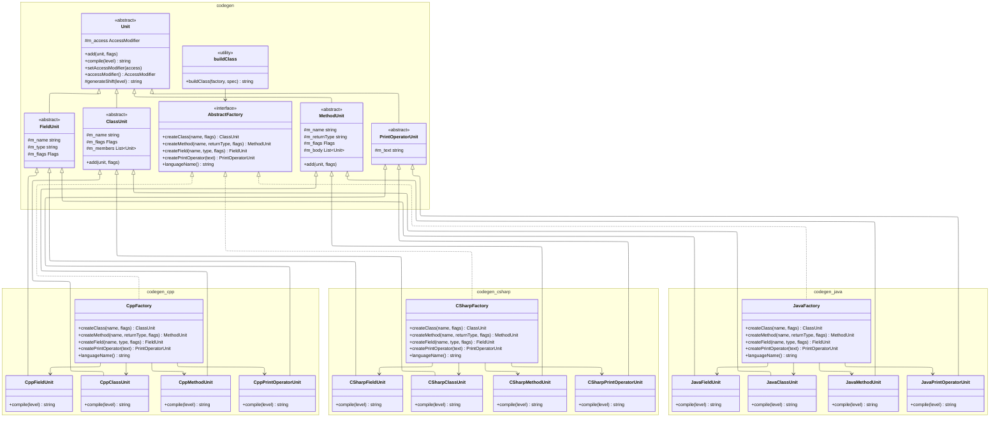

```mermaid
---
config:
  flowchart:
    nodeSpacing: 120
    rankSpacing: 120
  layout: elk
  look: classic
---
classDiagram
    namespace codegen {
        class Unit {
            <<abstract>>
            +add(unit, flags)
            +compile(level) string
            +setAccessModifier(access)
            +accessModifier() AccessModifier
            #generateShift(level) string
            #m_access AccessModifier
        }

        class AbstractFactory {
            <<interface>>
            +createClass(name, flags) ClassUnit
            +createMethod(name, returnType, flags) MethodUnit
            +createField(name, type, flags) FieldUnit
            +createPrintOperator(text) PrintOperatorUnit
            +languageName() string
        }

        class buildClass {
            <<utility>>
            +buildClass(factory, spec) string
        }

        class ClassUnit {
            <<abstract>>
            +add(unit, flags)
            #m_name string
            #m_flags Flags
            #m_members List~Unit~
        }

        class MethodUnit {
            <<abstract>>
            +add(unit, flags)
            #m_name string
            #m_returnType string
            #m_flags Flags
            #m_body List~Unit~
        }

        class FieldUnit {
            <<abstract>>
            #m_name string
            #m_type string
            #m_flags Flags
        }

        class PrintOperatorUnit {
            <<abstract>>
            #m_text string
        }
    }

    namespace codegen_cpp {
        class CppFactory {
            +createClass(name, flags) ClassUnit
            +createMethod(name, returnType, flags) MethodUnit
            +createField(name, type, flags) FieldUnit
            +createPrintOperator(text) PrintOperatorUnit
            +languageName() string
        }

        class CppClassUnit {
            +compile(level) string
        }

        class CppMethodUnit {
            +compile(level) string
        }

        class CppFieldUnit {
            +compile(level) string
        }

        class CppPrintOperatorUnit {
            +compile(level) string
        }
    }

    namespace codegen_csharp {
        class CSharpFactory {
            +createClass(name, flags) ClassUnit
            +createMethod(name, returnType, flags) MethodUnit
            +createField(name, type, flags) FieldUnit
            +createPrintOperator(text) PrintOperatorUnit
            +languageName() string
        }

        class CSharpClassUnit {
            +compile(level) string
        }

        class CSharpMethodUnit {
            +compile(level) string
        }

        class CSharpFieldUnit {
            +compile(level) string
        }

        class CSharpPrintOperatorUnit {
            +compile(level) string
        }
    }

    namespace codegen_java {
        class JavaFactory {
            +createClass(name, flags) ClassUnit
            +createMethod(name, returnType, flags) MethodUnit
            +createField(name, type, flags) FieldUnit
            +createPrintOperator(text) PrintOperatorUnit
            +languageName() string
        }

        class JavaClassUnit {
            +compile(level) string
        }

        class JavaMethodUnit {
            +compile(level) string
        }

        class JavaFieldUnit {
            +compile(level) string
        }

        class JavaPrintOperatorUnit {
            +compile(level) string
        }
    }

    AbstractFactory <|.. CppFactory
    AbstractFactory <|.. CSharpFactory
    AbstractFactory <|.. JavaFactory

    Unit <|-- ClassUnit
    Unit <|-- MethodUnit
    Unit <|-- FieldUnit
    Unit <|-- PrintOperatorUnit

    ClassUnit <|-- CppClassUnit
    MethodUnit <|-- CppMethodUnit
    FieldUnit <|-- CppFieldUnit
    PrintOperatorUnit <|-- CppPrintOperatorUnit

    ClassUnit <|-- CSharpClassUnit
    MethodUnit <|-- CSharpMethodUnit
    FieldUnit <|-- CSharpFieldUnit
    PrintOperatorUnit <|-- CSharpPrintOperatorUnit

    ClassUnit <|-- JavaClassUnit
    MethodUnit <|-- JavaMethodUnit
    FieldUnit <|-- JavaFieldUnit
    PrintOperatorUnit <|-- JavaPrintOperatorUnit

    buildClass --> AbstractFactory

    CppFactory --> CppClassUnit
    CppFactory --> CppMethodUnit
    CppFactory --> CppFieldUnit
    CppFactory --> CppPrintOperatorUnit

    CSharpFactory --> CSharpClassUnit
    CSharpFactory --> CSharpMethodUnit
    CSharpFactory --> CSharpFieldUnit
    CSharpFactory --> CSharpPrintOperatorUnit

    JavaFactory --> JavaClassUnit
    JavaFactory --> JavaMethodUnit
    JavaFactory --> JavaFieldUnit
    JavaFactory --> JavaPrintOperatorUnit
```
